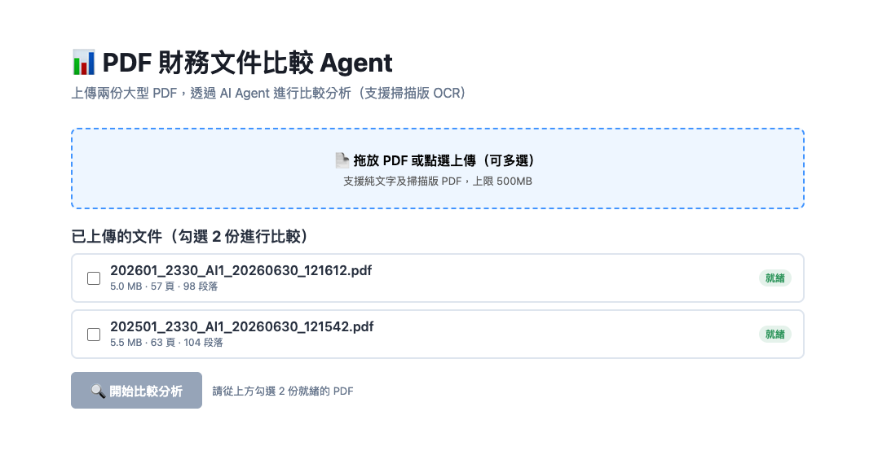
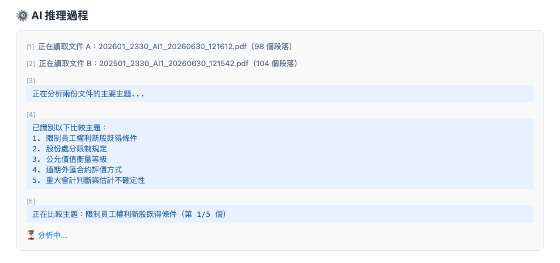
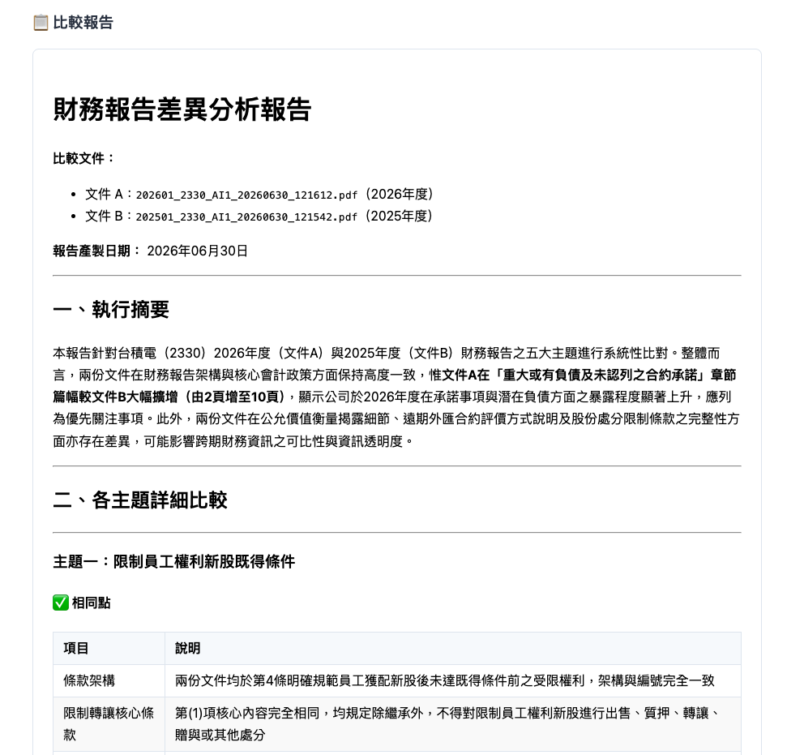

# PDF 財務文件比較 AI Agent

上傳兩份大型 PDF，透過 AI Agent 進行結構化比較分析，並即時串流顯示推理過程。

---

## 技術亮點

| 挑戰 | 解法 |
|------|------|
| PDF 過大無法塞進 Context Window | 前處理萃取文字 → 章節切割 → 向量索引，每次只傳相關段落給 LLM |
| 掃描版 PDF 無文字 | pdfplumber / pymupdf 失敗時自動 OCR fallback（pytesseract） |
| 比較主題不固定 | Topic Discovery：LLM 自動從文件內容發現值得比較的主題 |
| 推理過程不透明 | SSE 串流即時推送每個分析步驟至前端 |

---

## 系統架構

```
Browser (React)
    │  HTTP / SSE
    ▼
nginx (port 80/3000)  ← 反向代理
    │  /api/* →
    ▼
FastAPI (port 8000)
    ├── Session API      # 管理上傳 Session，30 分鐘 TTL 自動清除
    ├── Upload API       # PDF 上傳 → 背景前處理 Pipeline
    └── Compare API      # 啟動 Agent → SSE 串流推理步驟

PDF Pipeline（上傳後背景執行）：
  pdfplumber / pymupdf → OCR（視需要）→ 章節切割 → ChromaDB 向量索引

LLM Agent（3 步驟）：
  Step 1  Topic Discovery     自動發現 3~6 個比較主題
  Step 2  Per-Topic Compare   每個主題向量搜尋 + LLM 比較
  Step 3  Aggregation         彙整生成結構化 Markdown 報告
```

---

## 介面截圖

### PDF 上傳與文件管理



拖放或點選上傳 PDF，支援同時選取多個檔案。上傳後系統自動在背景進行文字萃取與向量索引，完成後狀態顯示「就緒」，並標示檔案大小、頁數與段落數。勾選任意兩份就緒的 PDF 即可啟動比較。

---

### AI 推理過程即時串流



比較啟動後，Agent 的每個推理步驟透過 SSE 即時推送至前端，可觀察到：讀取文件段落數 → 發現比較主題 → 逐主題進行比較的完整思考過程，讓 AI 分析過程完全透明可見。

---

### 結構化差異報告



分析完成後產出 Markdown 格式報告，包含執行摘要、各主題的相同點與差異點對照表、以及風險提示。報告在前端直接渲染為格式化頁面，表格、標題、粗體一應俱全。

---

## 快速啟動（本地）

### 前置需求

- Docker + Docker Compose
- LiteLLM Proxy（或任何相容 OpenAI API 的 endpoint）

### 步驟

**1. Clone 專案**

```bash
git clone https://github.com/120061203/fin-agent.git
cd fin-agent
```

**2. 建立環境變數檔**

```bash
cp .env.example .env
```

編輯 `.env`：

```env
LITELLM_BASE_URL=https://your-litellm-endpoint
LITELLM_API_KEY=your-api-key
LITELLM_MODEL=claude-sonnet-4-6
```

**3. 啟動所有服務**

```bash
docker compose up --build
```

**4. 開啟瀏覽器**

```
http://localhost:3000
```

---

## 使用方式

1. 上傳 PDF（支援多選，純文字或掃描版皆可，上限 500MB）
2. 等待狀態變為「就緒」（系統背景進行文字萃取與向量索引）
3. 勾選任意兩份 PDF
4. 點選「開始比較分析」
5. 即時觀看 AI 推理過程，完成後查看結構化差異報告

---

## 專案結構

```
fin-agent/
├── backend/
│   ├── app/
│   │   ├── api/
│   │   │   ├── session.py      # Session 管理（建立/刪除/TTL）
│   │   │   ├── upload.py       # PDF 上傳與前處理觸發
│   │   │   └── compare.py      # 比較 API + SSE 串流
│   │   ├── services/
│   │   │   ├── pdf_extractor.py  # pdfplumber / pymupdf 文字萃取
│   │   │   ├── ocr_service.py    # pytesseract OCR fallback
│   │   │   ├── chunker.py        # 章節識別 + tiktoken 切割
│   │   │   ├── indexer.py        # ChromaDB 向量索引
│   │   │   ├── agent.py          # 3 步驟比較 Agent
│   │   │   └── session_manager.py
│   │   └── main.py
│   ├── Dockerfile
│   └── requirements.txt
├── frontend/
│   ├── src/
│   │   ├── components/
│   │   │   ├── PDFUpload.tsx       # 拖放上傳 + 進度條
│   │   │   ├── PDFList.tsx         # PDF 列表 + 勾選
│   │   │   ├── ReasoningStream.tsx # SSE 推理步驟串流顯示
│   │   │   └── ComparisonReport.tsx # Markdown 報告渲染
│   │   └── services/api.ts
│   ├── nginx.conf
│   └── Dockerfile
├── docker-compose.yml
└── .env.example
```

---

## 環境變數

### 後端

| 變數 | 說明 | 預設值 |
|------|------|--------|
| `LITELLM_BASE_URL` | LiteLLM Proxy URL | 無（必填） |
| `LITELLM_API_KEY` | API 金鑰 | 無（必填） |
| `LITELLM_MODEL` | 使用的模型 | `claude-sonnet-4-6` |
| `ALLOWED_ORIGINS` | CORS 允許的前端網域（逗號分隔） | `http://localhost:3000,http://frontend` |

### 前端

| 變數 | 說明 | 預設值 |
|------|------|--------|
| `BACKEND_URL` | nginx 代理的後端位址 | `http://backend:8000` |

---

## 技術棧

| 層級 | 技術 |
|------|------|
| 前端 | React + TypeScript + Vite |
| 後端 | FastAPI + Python 3.11 |
| PDF 解析 | pdfplumber、pymupdf、pytesseract |
| 向量資料庫 | ChromaDB（EphemeralClient，記憶體內） |
| LLM | claude-sonnet-4-6（透過 LiteLLM Proxy） |
| 串流 | Server-Sent Events（SSE） |
| 容器化 | Docker + Docker Compose |
| 反向代理 | nginx |
